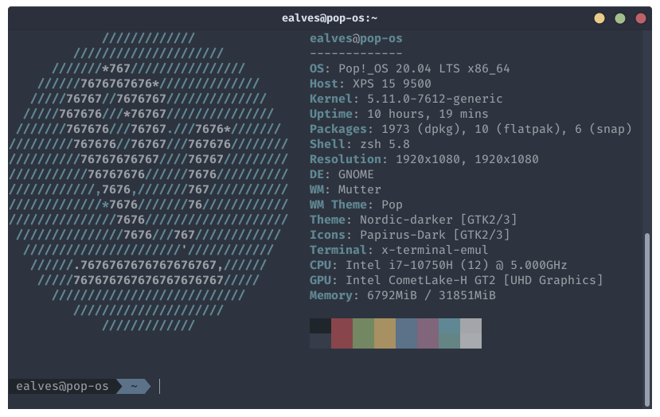
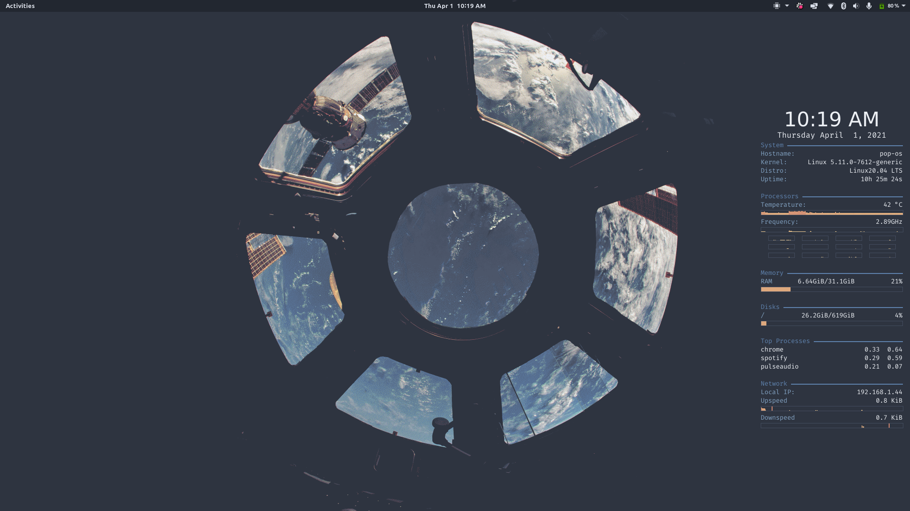
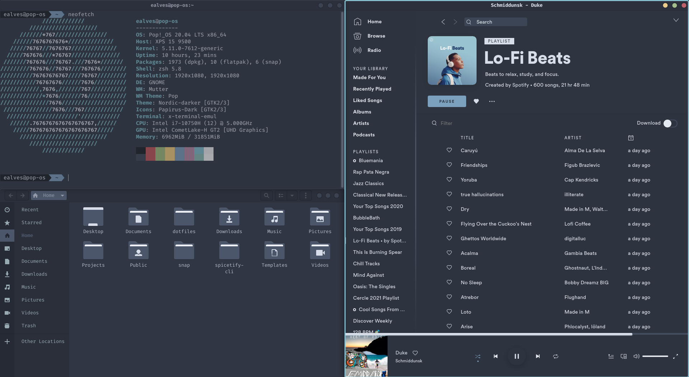

# dotfiles

## Install

1. clone the repository to $HOME
2. enter the folder and run `./install`
3. at the end of the script run `chsh -s $(which zsh)`
4. restart the laptop



## Appearence

* Nord Theme
  * [Slack](https://github.com/arcticicestudio/nord-slack)
  * [Spotify - Sleek Nord Theme](https://github.com/spicetify/spicetify-themes)
    * Needs [spicetify-cli](https://github.com/khanhas/spicetify-cli)
  * [Alacritty Theme](https://github.com/arcticicestudio/nord-alacritty)
  * [Vim](https://github.com/arcticicestudio/nord-vim)
  * [VS Code](https://github.com/arcticicestudio/nord-visual-studio-code)
* Font
  * [Fira Code](https://github.com/tonsky/FiraCode)
* Extensions
  * [Status Area Horizontal Spacing](https://extensions.gnome.org/extension/355/status-area-horizontal-spacing/)
* Walpapers
  * [nord-wallpapers](https://github.com/dxnst/nord-wallpapers)
  * [nord-backgrounds](https://github.com/dxnst/nord-backgrounds)

### Result




### Troubleshooting

#### Fingerprint

> For Dell XPS 15, 9500 and 9510

Following [this](https://www.reddit.com/r/Dell/comments/ixwgm0/xps_15_9500_ubuntu_popos_fingerprint_howto/)
thread I was abble to setup fingerprint on my XPS 9500. My device is:

The steps are:

1. `sudo apt install libfprint-2-2 libfprint-2-tod1`
2. download the goodix from [here](http://dell.archive.canonical.com/updates/pool/public/libf/libfprint-2-tod1-goodix/)
3. `sudo dpkg -i libfprint-2-tod1-goodix_0.0.6-0ubuntu1~somerville1_amd64.deb libpam-fprintd`
4. restart (:warning: really, restart it) and go to users in system settings to
enable the fingerprints
5. `sudo pam-auth-update` to set fingerprint as the authentication method

```zsh
lsusb | grep -i goodix
```

```txt
Bus 001 Device 002: ID 27c6:533c Shenzhen Goodix Technology Co.,Ltd. FingerPrint
```
