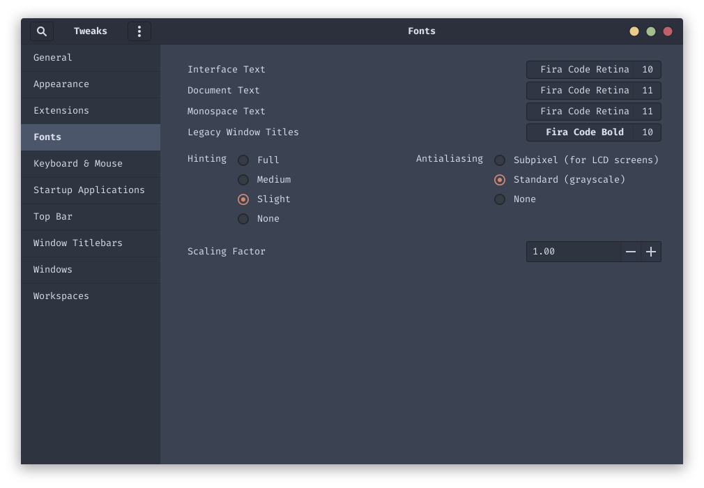

# dotfiles

> No longer just dotfiles...

## Appearence

* Theme
  * [Gnome Theme](https://github.com/EliverLara/Nordic)
  * [Slack](https://github.com/arcticicestudio/nord-slack)
  * [Spotify](https://github.com/morpheusthewhite/spicetify-themes/tree/master/Nord)
    * Needs [spicetify-cli](https://github.com/khanhas/spicetify-cli)
  * [Terminator Theme](https://github.com/arcticicestudio/nord-terminator)
  * [Vim](https://github.com/arcticicestudio/nord-vim)
  * [VS Code](https://github.com/arcticicestudio/nord-visual-studio-code)
* Icons
  * [Papirus Icons](https://github.com/PapirusDevelopmentTeam/papirus-icon-theme)
  * [Papirus Nord](https://github.com/Adapta-Projects/Papirus-Nord)
* Font
  * [Fira Code](https://github.com/tonsky/FiraCode)
* Extensions
  * [Status Area Horizontal Spacing](https://extensions.gnome.org/extension/355/status-area-horizontal-spacing/)
  * [Multi Monitors Add-On](https://extensions.gnome.org/extension/921/multi-monitors-add-on/)
* Walpapers
  * [nord-wallpapers](https://github.com/dxnst/nord-wallpapers)
  * [nord-backgrounds](https://github.com/dxnst/nord-backgrounds)

### Result

### Notes

I made **Fira Code** the default font in the entire system using Gnome Tweaks:

